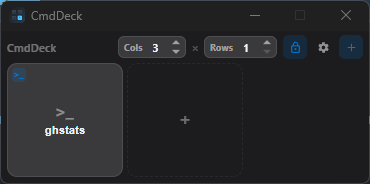
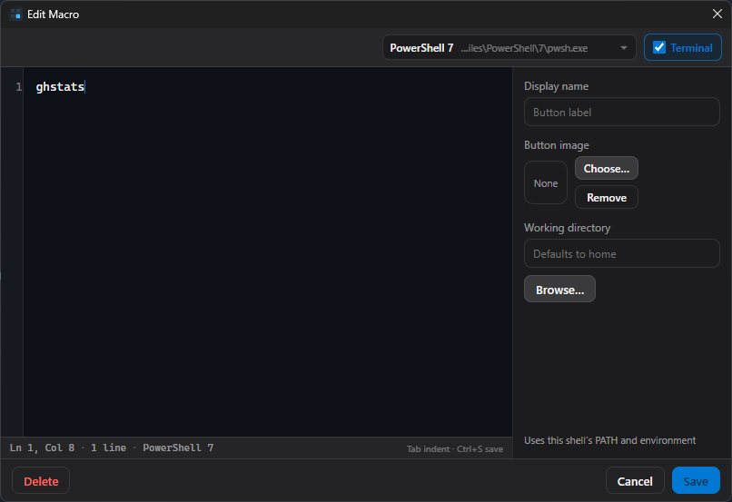

# CmdDeck - Macro Pad for Terminal Commands

[](https://github.com/taylorivanoff/cmd-deck/releases)
[](https://github.com/taylorivanoff/cmd-deck/releases)
[](LICENSE)

**CmdDeck** is an open-source, cross-platform **Stream Deck-style command launcher** for Windows and macOS. Build an always-on-top button macro pad that runs shell commands, scripts, and terminal shortcuts, choosing which shell runs each command (PowerShell, cmd, pwsh, Git Bash, zsh, bash) and optionally attaching a console to monitor output.

Ideal for developers or power users who want a lightweight **desktop command palette** / macro pad without dedicated hardware.

## Features

- Compact **always-on-top** command grid (toggleable)
- Run short or multi-line shell commands in the background
- **Run with** a selected shell so PATH/environment match that shell (e.g. tools available in PowerShell but not cmd)
- Optional attached console per key to monitor output and cancel
- Button face: custom image, display name, or command text fallback
- Optional working directory per command
- Tray icon with show/hide, always-on-top, start minimised, updates
- Window bounds persistence, splash screen, single-instance, auto-updater
- **Profiles and pages** — multiple decks with tabbed pages
- **Macro packs** — import/export `.cmddeck-pack.json`; 7 built-in starter packs in `packs/`
- **Global hotkeys** — optional shortcut per macro (e.g. `Ctrl+Shift+1`)
- **Confirm before run** — safety prompt for destructive commands
- **Workflow variables** — `{{date}}`, `{{cwd}}`, `{{env:VAR}}`, `{{gitBranch}}` in commands
- **SSH remote macros** — run commands on remote hosts over SSH
- **LAN web remote** — control the deck from a phone on the same Wi‑Fi
- **Action types** — run command, open URL, open path, or SSH

## Installation

### Windows

1. Download the latest installer from [Releases](https://github.com/taylorivanoff/cmd-deck/releases)
2. Run the installer and follow the prompts

### Linux

1. Download the `.deb` or `.AppImage` from [Releases](https://github.com/taylorivanoff/cmd-deck/releases)
2. **deb:** `sudo dpkg -i cmd-deck_*.deb`
3. **AppImage:** `chmod +x CmdDeck_*.AppImage` then run it

No udev rules are required — CmdDeck is a software-only macro pad.

### macOS

1. Download the `.dmg` from [Releases](https://github.com/taylorivanoff/cmd-deck/releases) and drag **CmdDeck** to Applications
2. macOS may say the app is “damaged” - that is Gatekeeper blocking an unsigned download, not a bad file. Go to System Preferences -> Security & Privacy, then "Open anyway".

## Development

```bash
bun install
bun run dev
```

### Building

```bash
bun run build
```

### Releasing

Bump the `version` in `package.json` and push to `master`. The GitHub Actions workflow builds Windows and macOS installers, uploads updater metadata, and creates a GitHub Release.

## Usage

1. Click **+** (or the empty tile) to add a command
2. Enter a command and pick **Run with** (PowerShell, cmd, etc.)
3. Optionally enable **Show terminal window**, set a display name, image, and working directory
4. Click a button to run; click again while running to stop
5. Right-click a button for Run / Edit / Duplicate / Delete

### Screenshots

Main command grid:



Macro editor:



## Example macros

Think in **workflows**, not one-off commands: each button should replace a ritual you repeat (start the day, ship a PR, prep a meeting). Set **Working directory** per macro when it matters. Use **Show terminal window** for anything long-running or that you need to watch.

CmdDeck supports **multi-line** commands — paste a small script into the Command field.

### Developer workflows

**Boot a project** (set cwd to the app; PowerShell / zsh):

```bash
git pull
composer install
npm install
php artisan migrate
docker compose up -d
```

**Start a coding session** (Laravel + Vite; enable Show terminal, or split into two buttons):

```bash
docker compose up -d
php artisan queue:work &
npm run dev
```

**Ship check before PR** (set cwd to the repo):

```bash
git status
npm run lint
npm test
gh pr checks
```

**GitHub public repository download counts and stars** (PowerShell; requires authenticated `gh`):

```powershell
gh repo list --visibility public --limit 1000 --json nameWithOwner,stargazerCount |
  ConvertFrom-Json |
  ForEach-Object {
    $repo = $_.nameWithOwner
    $stars = $_.stargazerCount
    $downloads = 0
    gh api "repos/$repo/releases" --paginate --jq '[.[].assets[].download_count] | add // 0' 2>$null |
      ForEach-Object { $downloads += [int]$_ }
    [pscustomobject]@{
      Repo      = $repo
      Stars     = $stars
      Downloads = $downloads
    }
  } |
  Sort-Object Downloads, Stars -Descending |
  Format-Table -AutoSize
```

**Hotfix local data**:

```bash
php artisan migrate:fresh --seed
php artisan cache:clear
php artisan config:clear
php artisan view:clear
```

**Unstick a busy port, then serve** (PowerShell):

```powershell
Get-NetTCPConnection -LocalPort 8000 -ErrorAction SilentlyContinue |
  ForEach-Object { Stop-Process -Id $_.OwningProcess -Force -ErrorAction SilentlyContinue }
php artisan serve
```

**Unstick a busy port, then serve** (zsh):

```bash
lsof -ti:8000 | xargs kill 2>/dev/null
php artisan serve
```

Handy single-button companions (same cwd):

| Button | Command | Notes |
| --- | --- | --- |
| Queue | `php artisan queue:work` | Show terminal |
| Frontend | `npm run dev` | Show terminal |
| Logs | `docker compose logs -f --tail=200` | Show terminal |
| Open in editor | `code .` | Instant |

### Everyday workflows

**Start workday** — open the tools you always need (Windows, PowerShell; edit URLs/apps):

```powershell
Start-Process "https://mail.google.com"
Start-Process "https://calendar.google.com"
Start-Process "https://github.com/notifications"
Start-Process "slack://"
code "$env:USERPROFILE\Projects"
```

**Start workday** (macOS, zsh):

```bash
open https://mail.google.com
open https://calendar.google.com
open https://github.com/notifications
open -a Slack
code ~/Projects
```

**Meeting prep** - pull notes folder + open call link (edit paths/URL):

```powershell
$notes = "$env:USERPROFILE\Documents\MeetingNotes"
Start-Process explorer.exe $notes
Start-Process "https://meet.google.com/your-room"
```

```bash
open ~/Documents/MeetingNotes
open "https://meet.google.com/your-room"
```

**Client delivery zip** - stage today’s folder and compress (Windows, PowerShell; edit paths):

```powershell
$day = Get-Date -Format yyyy-MM-dd
$src = "$env:USERPROFILE\Documents\Clients\Acme\Outgoing"
$dst = "$env:USERPROFILE\Desktop\Acme-$day.zip"
Compress-Archive -Path "$src\*" -DestinationPath $dst -Force
explorer.exe /select,$dst
```

**Weekly project backup** (Windows, PowerShell):

```powershell
$src = "$env:USERPROFILE\Projects"
$dst = "D:\Backups\Projects-$(Get-Date -Format yyyy-MM-dd)"
New-Item -ItemType Directory -Force -Path $dst | Out-Null
robocopy $src $dst /MIR /R:1 /W:1 /NFL /NDL /NJH /NJS
Write-Host "Backup complete: $dst"
```

**Tidy Downloads older than 30 days** (Windows, PowerShell):

```powershell
$downloads = [Environment]::GetFolderPath("UserProfile") + "\Downloads"
Get-ChildItem $downloads -File |
  Where-Object { $_.LastWriteTime -lt (Get-Date).AddDays(-30) } |
  Remove-Item -Force
Write-Host "Old Downloads cleaned."
```

```bash
find ~/Downloads -type f -mtime +30 -delete
echo "Old Downloads cleaned."
```

## Notes

- Detects installed shells from PATH / OS locations (`powershell`, `pwsh`, `cmd`, Git Bash, WSL, zsh, bash, fish, Nushell, and `/etc/shells` entries)
- Defaults to PowerShell 7/Windows PowerShell on Windows, or `$SHELL` / zsh / bash on macOS/Linux
- Commands run with a rebuilt login-like PATH (OS env + common tool bins) so GUI/IDE launches still find Herd, Scoop, Homebrew, nvm, etc.
- Button images are embedded directly into the saved macro, so they stay available after you move or delete the originals

## Keywords

Stream Deck alternative, command launcher, terminal shortcuts, macro pad, always-on-top command grid, Tauri desktop app, Windows Terminal launcher, shell command buttons

## Contributing

Contributions are welcome! Please feel free to submit a Pull Request.

## License

MIT

